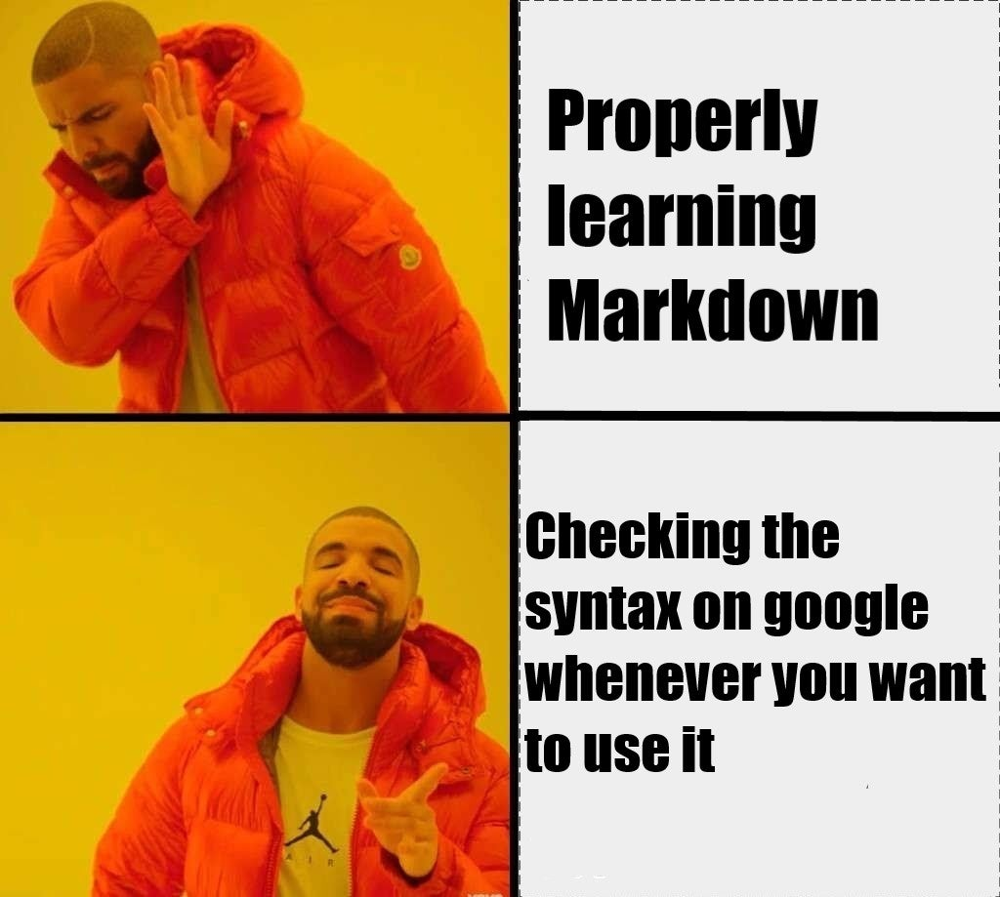

# Additional Resources

-   [R Markdown for RStudio](https://rmarkdown.rstudio.com/)
-   [R Markdown Cheatsheet](https://doi.org/10.1093/oso/9780197582756.003.0009)
-   [R Markdown Reference Guide](https://www.rstudio.com/wp-content/uploads/2015/03/rmarkdown-reference.pdf?_ga=2.116454790.1075794466.1676401806-680139860.1644522425)
-   [R Markdown Definitive Guide](https://bookdown.org/yihui/rmarkdown/)
-   [R Markdown Cookbook](https://bookdown.org/yihui/rmarkdown-cookbook/)

------------------------------------------------------------------------

# About R Markdown

R Markdown allows you to blend formatted prose with code to create reproducible scientific documents that can be outputted in a HTML, PDF, and MS Word document.

Clicking on the **Knit** button in the editor toolbar will generate a document that includes both the content as well as the output of any embedded R code chunks within the document.

-   Global Options
-   Markdown Quick Reference (Help)

### Why Bother?

1.  Encourages you to document your analysis
2.  Provides a non-proprietary format that you can easily store, preserve, document with metadata, and retrieve at later dates.
3.  Reproducibility means that you can share the document with colleagues and peers to check errors or to collaborate easily. R Markdown even allows for multiple coding languages to be used in a single document.
4.  Create reports/documents that are dynamically generated from you data and can be easily revised. R Markdown documents are dynamic and an errors or issues with the coding can be made with little work on the user's end.

-   No longer do you need to re-code and re-paste

------------------------------------------------------------------------

# YAML Header

      - YAML AIN'T MARKUP LANGUAGE

This is the metadata area for your document and it also determines how the document is rendered when you knit it. It's default fields are **title**, **author**, **date**, and **output**. But you can add more fields.

About YAML:

- White spaces matter: indents indicate the contents are *child* of the level above
    + Spaces not tabs
- Boolean operators: true/false is lowercase
- true/false ~ yes/no
- Entries can include exectuable code
    + "`r Sys.Date()`"
- Most common outputs are *html_document*, *pdf_document*, and *word_document*
    + [Full listing of available formats](https://rmarkdown.rstudio.com/formats.html)

 

------------------------------------------------------------------------

# Formating Options

The following will provide ways for you to format your text/prose within the document that you are editing

# Header 1

## Header 2

### Header 3

#### Header 4

##### Header 5

###### Header 6

Italics - *I am italic - mama mia*

Bold - **I am bold**

Hyperlink - You can learn more about [RMarkdown here](https://rmarkdown.rstudio.com/)

Image - 

Footnote[^1]: `Footnote^[This is a footnote]`

Block quote

> "You miss 100% of the shots you do not take. - Wayne Gretsky" - Michael Scott

Unordered lists:

-   apple
-   pear
-   orange
-   bear
    -   orange bear
    -   apple pear

Ordered lists:

1.  Apple
2.  Pear
3.  Orange Bear

------------------------------------------------------------------------

# Document Editors

You can change the way that you edit the document by using the **Source** or **Visual** tab on the editor toolbar.

### Source

-   Allows you view the document in code view

### Visual

-   Allows you to view the document with markups
-   Allows basic WSYWIG

------------------------------------------------------------------------

# Code Chunks

Code chunks allow you to include code from multiple languages into your narration.

You can insert a chunk code by:

-   CTRL + ALT + I (PC)

-   COMMAND + OPTIONS + I (MAC)

-   Use **Add Chunk** command in editor toolbar

        Let's add a code chunk that allows us to see the data set mtcars

```{r}

mtcars

```

#### Running a Code Chunk

You can run a code chunk by:

-   CTRL + SHIFT + ENTER (PC)
-   COMMAND + SHIFT + ENTER (MAC)
-   Run button in Code Chunk
-   Run button in editor toolbar

------------------------------------------------------------------------

## Customize Chunk Code

### Chunk Cog Wheel

-   Allows you to rename the chunk so it can be easily located
-   Allows you to set message and warning displays
-   Allows you to adjust plot sizes

#### Include

Include allows you to include or not include the chunk code in the final product when knitted.

> include =

        Let's create a chunk code that sets our current working directory but does not display the code or output in our final product using include. Hint: Set the working directory with the command - setwd()

```{r include=FALSE}

setwd("C:/Users/Matt/Documents/RWorkshop Development/workshop_rmarkdown_spr2023")


```

#### Eval

Eval tells RStudio to either run or not run a code chunk when the document is knitted

> eval =

        Let's install the CRAN package Tidyverse. But since this is a one time operation, let's preface that this code is not run when the document is knitted. Hint: You can also use multiple output commands but you will need to seperate them with a comma (,)

```{r eval=FALSE, include=FALSE}

install.packages("tidyverse")

```

#### Message

Some commands, like loading a package, will display messages after the code is run. You can choose whether or not you want the

> message =

        Let's load the tidyverse package because we will need functions in it to run furture code in the report. However, let's set it so the load message does not appear when the document is knitted.

```{r message=FALSE}
library(tidyverse)


```

#### Echo

Echo allows you to show the output of the code that has been run, but not to show the code chunk when the document is knitted

> echo =

        Let's get the results of a line of code without displaying the code in the report.

```{r echo = FALSE}
summary(mtcars)
```

------------------------------------------------------------------------

# Inline Code

You can include coding within the body of your work using inline code using the backtic (\`) button on your keyboard

        Let's include inline code with the mean of the mpg varibale in the mtcars dataset as well as the number of obsertvations of the variable

The average miles per gallon from the cars dataset is `r mean(mtcars$mpg)` based on `r nrow(mtcars)` observations

------------------------------------------------------------------------

# Plots

------------------------------------------------------------------------

# Citations

R Markdown allows you to insert citations as well as work with citation managers such as [Zotero](https://databases.lib.wvu.edu/connect/1498075110) and [CiteDrive](https://www.citedrive.com/). Once a citation is added to the document, it will automatically populate in a bibliography at the end of the document.

Insert Citations into your document:

-   Visual Mode: Insert \> Citation
-   Source Mode: [@auerbach2021] or (See [@grolemund])
-   Visual Mode: \@ will show you available citations

When a Citation is generated:

-   A new .bib file will be created in the current working directory and will be attached to the document in the YAML header

-   The default format for the citations is **Chicago Turabian**. If you want to change the format you will need to download the proper .csl file and add it to your working directory and add a csl field to your YAML header

    -   [Zotero Library](https://www.zotero.org/styles)

    -   [Citation Visual Editor](https://editor.citationstyles.org/about/)

##### Let's try and find and enter the citation for the [following article](https://pubmed.ncbi.nlm.nih.gov/34303462/)

-   10.1016/j.jvs.2021.03.055

------------------------------------------------------------------------

# References
